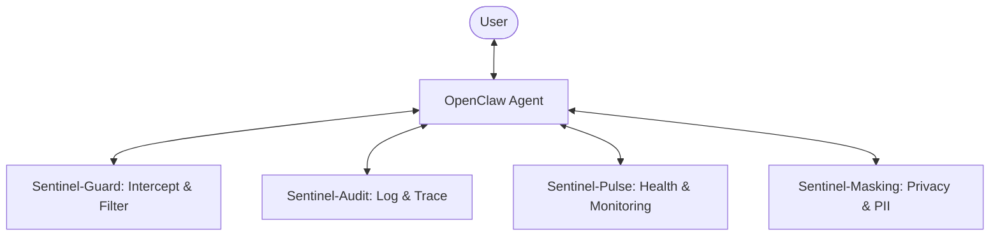

# OpenClaw-Sentinel (OC-Sentinel)

An open-source security and monitoring suite for OpenClaw-based AI agents.

## Architecture



## Modules

- **Sentinel-Guard**: Intercepts tool calls and shell commands to prevent dangerous actions based on customizable policies.
- **Sentinel-Audit**: A comprehensive auditing system that records every action for full accountability.
- **Sentinel-Pulse**: Monitors performance, resource usage, and health heartbeats.
- **Sentinel-Masking**: Ensures PII and sensitive credentials never leak by redacting them in real-time.

## Installation

```bash
git clone https://github.com/JoeWangYZ/OpenClaw-Sentinel.git
cd OpenClaw-Sentinel
pip install -e .
```

## Contributing

We welcome contributions! Please follow these guidelines:
1.  Fork the repository.
2.  Create a feature branch (`git checkout -b feature/cool-new-thing`).
3.  Commit your changes.
4.  Push to the branch.
5.  Open a Pull Request.

Please ensure your code follows the established style and includes tests.

## License
MIT License
